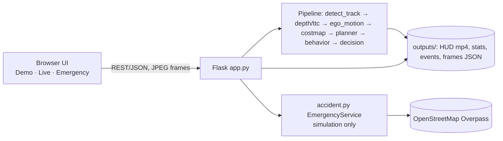

# PathSense — Prototype Documentation (technical reference for the demo video)

## 1. Prototype Overview
- **What it is:** a camera-only research prototype for SIH26037 (adaptive path planning and collision avoidance on unstructured Indian roads), with a Python/Flask web app.
- **Problem it demonstrates:** Indian roads often have no lane markings and mixed traffic (autos, two-wheelers, pedestrians, cattle). The vehicle must judge which road users actually threaten its path.
- **What the user can do:** play processed drives, upload a video to be processed, run live analysis from a phone/webcam camera, replay key decision moments, and run a simulated emergency workflow.
- **What it demonstrates:** perception → tracking → depth/TTC → bird's-eye cost map → candidate-path planning → an explained decision (GO / STEER / SLOW DOWN / BRAKE / NO SAFE PATH).

## 2. Main Features
| Feature | User interaction | What happens internally |
|---|---|---|
| Demo playback | Demo tab → pick a drive | Plays the processed HUD video; the decision panel and timeline come from per-frame JSON (`/api/demos/...`) |
| Video upload | Demo → Upload | `/api/upload` starts a background job running the full pipeline (`main.py`); progress via `/api/jobs/<id>` |
| Live mode | Live tab → start camera | Browser sends JPEG frames to `/api/live/frame`; `live.py` runs the same pipeline per frame and returns the decision |
| Replay of key moments | Demo → Replay list → click a moment | Shows object, distance, TTC, path status and hold time for that event; seeks the video |
| Path-threat decision | automatic | Oncoming traffic on its own side / footpath pedestrians → watched; road users entering the ego path → SLOW/BRAKE; BRAKE held while the conflict remains |
| Emergency (simulation) | Emergency tab → Simulate accident alert | Prepares a message, looks up nearby hospitals (OpenStreetMap Overpass), asks for confirmation — **nothing is ever sent or called** |

## 3. Technology Stack
- **Python 3.10** — whole backend and pipeline.
- **YOLOv8n (Ultralytics)** — object detection; **ByteTrack** — multi-object tracking (IDs over time).
- **Depth-Anything-V2-Small** — monocular depth, calibrated against the road plane for metric distance estimates.
- **CLIP ViT-B/32 (transformers)** — zero-shot refinement to recognise auto-rickshaws.
- **PyTorch + CUDA** — GPU inference; **OpenCV** — video I/O, optical flow, HUD drawing; **NumPy** — cost map and planner maths.
- **Flask** — web server and REST API; **HTML / CSS / JavaScript** — frontend (no framework).
- **OpenStreetMap Overpass API** — read-only nearby-hospital lookup in the emergency simulation.

## 4. Architecture

- Offline drives/uploads are processed by `main.py` into files in `outputs/`; the browser plays them back.
- Live mode keeps one `LivePipeline` session on the server and processes each posted frame.

## 5. End-to-End Workflow
1. User → Demo tab → selects (or uploads) a drive.
2. Flask → pipeline per frame: YOLOv8n + ByteTrack → depth + road-plane calibration → TTC → ego-speed (optical flow).
3. → BEV cost map (hard footprints + soft halos per road-user class) → planner scores 17 bicycle-model arcs (±15°).
4. → behaviour cues (cut-in, crossing, oncoming, slow lead) → decision state machine with hysteresis → reason text.
5. → HUD video + events/frames JSON → browser shows video, decision panel, timeline and replay list.

## 6. Prototype Screens / Demo Flow (the four screenshots on the Prototype slide, `presentation/assets/screens/`)
1. **Landing page (`1_home`)** — project summary and "Try PathSense" button. Presenter: this is the entry point; the app has three tabs.
2. **Demo playback (`2_demo`)** — Bengaluru drive: boxes with IDs, bird's-eye candidate trajectories, decision panel (SLOW DOWN, nearest threat, distance, TTC). Presenter: the decision always comes with a reason.
3. **Replay (`3_replay`)** — decision timeline plus key moments; the selected card shows object, distance, TTC, path status. Presenter: every decision is auditable.
4. **Emergency (`4_emergency`)** — demo contact form, location/hospital lookup, "Simulate accident alert". Presenter: simulation mode only; the user must confirm; nothing is sent.

## 7. Technical Implementation
- **Distance:** relative depth from Depth-Anything is scaled using the flat road plane (camera height / horizon) — an estimate, not a measurement.
- **TTC:** smoothed depth derivative, gated by bounding-box growth.
- **Planner:** arcs are rejected only if they physically overlap hard occupancy (vehicle footprint; pedestrians/animals + 0.3 m margin); soft halos only add cost.
- **Decision:** path-threat classes (IN_PATH / ENTERING / APPROACHING / NEAR / CLEAR), left-hand-traffic aware, BRAKE persistence and hysteresis.
- **Testing:** `scenario_tests.py` — synthetic safety scenarios (oncoming, footpath pedestrians, crossings, cattle), runnable via `/api/system/run-tests`.

## 8. Demo Scenario (5–7 min)
1. Start `python app.py`, open `http://127.0.0.1:8000` → show the landing page (30 s).
2. Try PathSense → Demo → `India Bangalore` → play; pause on an auto-rickshaw/pedestrian moment and read the panel (2 min).
3. Scroll to Replay → click a BRAKE moment → explain object, TTC, path status (1 min).
4. Optional: Upload a short clip and show the job progress; or Live tab with a webcam (1 min).
5. Emergency tab → Simulate accident alert → show the confirmation step and that nothing is sent (1 min).
6. Close with limitations (30 s).

## 9. Current Prototype Limitations
- Camera only; distances, speeds and TTC are monocular **estimates**. No radar/LiDAR.
- Not real time on the development laptop for full-resolution video; not certified; no vehicle actuation/control.
- MATLAB / Simulink / RoadRunner closed-loop validation: **Not verified in the current prototype** (not implemented).
- Accident detection is a heuristic and can mark "possible collision (unconfirmed)"; emergency features are simulation only.
- Validation is on a limited set of recorded drives; phone live mode needs HTTPS (`--lan --https`, self-signed certificate).

## 10. Key Points for Presenter
- The core idea is **threat to the ego path, not proximity**.
- Every decision is **explainable** (reason text, replay card).
- Same pipeline for recorded video, uploads and live frames.
- Never claim real-world autonomy, certification or real emergency calling.

## Using This Document to Generate the Presentation Script
Give this file to ChatGPT with: *"This Markdown file describes our actual prototype. Generate a natural 5–7 minute online demo/presentation script based strictly on this document. Include what I should say, what I should show on screen, and when I should demonstrate each feature. Do not invent features or technical details."*
Structure: **Introduction → Problem → Prototype → Architecture → Live Demo → Key Features → Technical Explanation → Limitations → Conclusion.** This file remains a technical reference, not the speech itself.
